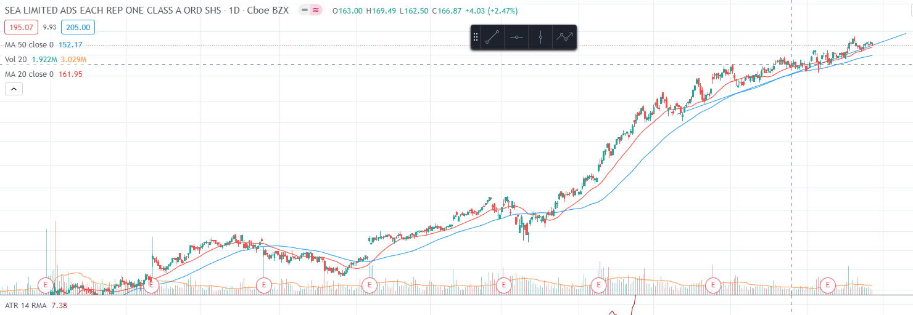

# Momentum-Stock-Indicator

This scipt finds the % of time a stock was above the 20 moving average.
The more time a stock is above the 20 moving average the higher its moving up.
This should allow any investor to find high trending stocks. 
In my opinion it is best if the indicator is used for two different time frames.
Find the % of time stocks where above the 20 moving average for the past year, and 
the last two months. If both indicate strong trends then it should warrant a buy. 

This was created with the purpose of finding strong trending stocks, as i failed to find
any good trend indicators other than 52 week high, stochastics, etc..

